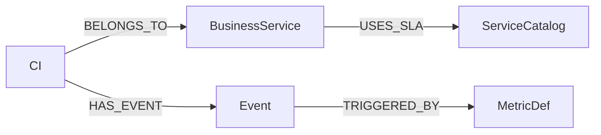

# Business Domain Model

## Proposito

Este documento define el lenguaje comun para el contexto de negocio que se muestra en el modal de detalle de eventos.

## Entidades clave

### CI

- Representa un Configuration Item tecnico: router, switch, servidor, aplicacion o servicio operativo.
- Es la entidad que produce telemetria, recibe metricas y dispara eventos.

### BusinessService

- Representa el servicio de negocio al que pertenece un CI.
- Campos usados por el detalle del evento:
  - `id`
  - `name`
  - `tier` opcional
  - `owner_t1`
  - `owner_t2`
  - `owner_t3`
  - `impacted_users_count`

### ServiceCatalog

- Define el objetivo de SLA para una categoria de servicio.
- Campos usados hoy:
  - `id`
  - `category`
  - `service_tier` opcional
  - `sla_minutes`

## Relaciones canonicas



- `CI -[:BELONGS_TO]-> BusinessService`
- `BusinessService -[:USES_SLA]-> ServiceCatalog`
- `CI -[:HAS_EVENT]-> Event`
- `Event -[:TRIGGERED_BY]-> MetricDef`

## Snapshot de evento

Cuando se crea un evento nuevo, el worker guarda en el nodo `Event` una foto del contexto que importa para operaciones:

- `business_service_id`
- `business_service_name`
- `business_service_tier`
- `owner_t1`
- `owner_t2`
- `owner_t3`
- `impacted_users`
- `site`
- `service_catalog_id`
- `service_category`
- `service_tier`
- `sla_minutes`

Esto evita drift historico cuando un CI cambia de servicio, owners o SLA despues del incidente.

## Semantica snapshot vs fallback

- `snapshot`: todos los datos mostrados vienen del `Event`.
- `resolved`: el `Event` no tenia snapshot y el backend resolvio todo desde el grafo actual.
- `mixed`: parte viene del snapshot y parte se completo desde relaciones actuales.
- `unavailable`: ni snapshot ni relaciones actuales pudieron resolver contexto suficiente.

La UI no debe inventar datos faltantes desde metadata arbitraria del CI. Solo se conserva `node.metadata` como ultimo fallback de rollout para no romper el modal mientras se completa la migracion.

## Owners y escalacion

- `owner_t1`, `owner_t2`, `owner_t3` describen responsables esperados por tier.
- No implican asignacion activa por si solos.
- La asignacion activa del incidente sigue viniendo del propio `Event` (`ack`, `ack_by`) y del `itsm_context` devuelto por la API.

## Usuarios impactados

- `impacted_users_count` es una aproximacion operacional, no una medicion en tiempo real.
- Se usa para priorizacion y lectura rapida del impacto.
- Si no existe dato confiable, el contrato devuelve `null` y la UI muestra `No configurado`.

## Decisiones de modelado

- `ServiceCatalog` se modela por categoria con `service_tier` opcional.
- El detalle del evento expone `ci_ref.id` como identificador canonico del CI.
- `ci_node_id` sigue existiendo solo en el resumen para compatibilidad con consumidores viejos.

## Bootstrap manual minimo

Mientras no exista CRUD dedicado, se puede sembrar el contexto con Cypher:

```cypher
MERGE (ci:CI {id: 'ci-001'})
MERGE (bs:BusinessService {id: 'svc-corp-wan'})
SET bs.name = 'Corp-WAN',
    bs.tier = 'T2',
    bs.owner_t1 = 'Mesa N1',
    bs.owner_t2 = 'NetOps',
    bs.owner_t3 = 'Arquitectura',
    bs.impacted_users_count = 350
MERGE (sc:ServiceCatalog {id: 'sla-corp-wan'})
SET sc.category = 'NETWORK',
    sc.service_tier = 'Gold',
    sc.sla_minutes = 60
MERGE (ci)-[:BELONGS_TO]->(bs)
MERGE (bs)-[:USES_SLA]->(sc)
```

## Lectura recomendada

- Arranca por `README.md` para el mapa general.
- Usa `docs/itsm/event-flow.md` para entender como este modelo impacta el lifecycle del evento.
