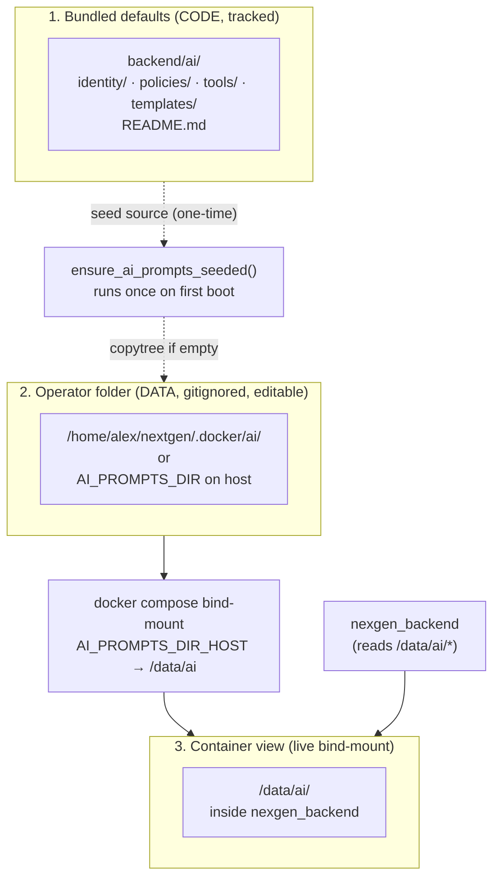
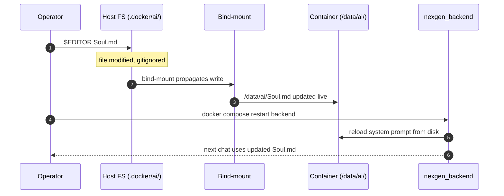

# AI Prompts Runbook

> **Audience:** operators who edit AI behavior, on-call deployers, and reviewers
> auditing how NEX-GEN decides what the AI assistant is allowed to say.
>
> **Related docs:**
> - [`docs/ai.md`](ai.md) — consolidated AI operator entry point and runtime
>   boundary summary.
> - [`docs/lm-studio-ai-chat.md`](lm-studio-ai-chat.md) — LM Studio integration
>   and how the backend composes the system prompt.
> - [`docs/AI_AGENT_GUIDE.md`](AI_AGENT_GUIDE.md) — external AI agents via REST
>   (roles `AI_DIAGNOSTIC`, `AI_OPERATOR`); different scope.
> - [`backend/ai/README.md`](../backend/ai/README.md) — bundled defaults tree
>   and the load model (authoritative source for code paths).
> - [`backend/services/ai_chat_service.py`](../backend/services/ai_chat_service.py) —
>   `ensure_ai_prompts_seeded()` and `_resolve_prompt()` (frozen + fallback logic).
> - [`backend/main.py`](../backend/main.py) — startup hook that calls
>   `ensure_ai_prompts_seeded()` (line ~292).
> - [`docker-compose.yml`](../docker-compose.yml) — `AI_PROMPTS_DIR` env and
>   bind-mount (lines 88, 93).
> - [`.env.example`](../.env.example) — `AI_PROMPTS_DIR` / `AI_PROMPTS_DIR_HOST`
>   contract (lines 83–87).
> - `openspec/changes/ai-chat-markdown-policies/` — SDD change that introduced
>   the operator-owned prompts folder in v1.13.0.

This runbook documents **the lifecycle of the markdown files that govern the
NEX-GEN assistant** (`backend/ai/identity/Soul.md`, policies, templates, tool
contracts). The runtime mechanics live in code; this document explains what
operators need to know to edit, deploy, and audit those files without breaking
the contract.

---

## TL;DR

There are **three layers** and the AI reads from the middle one:



**One-line summary:** bundled is read-only code, operator is your editable
data, container is the live view. The seed runs once; after that the operator
folder is frozen from the backend's perspective.

---

## The two variables

| Variable | Where it lives | What it points at |
|---|---|---|
| `AI_PROMPTS_DIR` | **Inside** the container (env var) | Where the backend **reads** the prompts (`/data/ai` in Docker). |
| `AI_PROMPTS_DIR_HOST` | **On the host** (`.env`) | The host path **bind-mounted** into `/data/ai` (default `.docker/ai`). |

`AI_PROMPTS_DIR` is **hardcoded** to `/data/ai` in `docker-compose.yml:88`. The
backend reads it via `get_ai_prompts_settings()` in
[`backend/services/ai_chat_service.py`](../backend/services/ai_chat_service.py).
Do not change it unless you also change the bind-mount target.

`AI_PROMPTS_DIR_HOST` is the operator knob. Default is `.docker/ai` (relative
to the docker-compose working directory).

> **Common mistake:** setting `AI_PROMPTS_DIR=/some/host/path` in `.env`. That
> env var is read **inside the container**, so a host path there resolves to a
> non-existent path in the container's filesystem. Use `AI_PROMPTS_DIR_HOST`
> for the host-side bind-mount.

---

## Local dev vs Docker

### Local dev (no container)

```bash
# .env
AI_PROMPTS_DIR=./.ai
# AI_PROMPTS_DIR_HOST not used here
```

1. Set `AI_PROMPTS_DIR=./.ai` in `.env`.
2. Start the backend (`uvicorn main:app --reload`).
3. On first boot, `ensure_ai_prompts_seeded()` copies `backend/ai/` into `./.ai/`.
4. Edit `./.ai/identity/Soul.md` (or any other file) — backend picks it up on
   the next request.

### Docker (production / `safe-rebuild.sh`)

```bash
# .env
AI_PROMPTS_DIR_HOST=/home/alex/nextgen/.docker/ai
# AI_PROMPTS_DIR is hardcoded to /data/ai in docker-compose.yml
```

1. `docker compose up -d` brings up `nexgen_backend`.
2. Bind-mount: `/home/alex/nextgen/.docker/ai` (host) → `/data/ai` (container).
3. On first boot, the operator folder is empty, so the seed copies
   `backend/ai/` into `/home/alex/nextgen/.docker/ai` **on the host** (because
   the bind-mount is two-way).
4. Edit `/home/alex/nextgen/.docker/ai/identity/Soul.md` — the container sees
   it live via the bind-mount (no restart needed for the file change to take
   effect, but a backend restart reloads the in-memory system prompt).

---

## First boot seed

Source: [`backend/services/ai_chat_service.py:96-112`](../backend/services/ai_chat_service.py).

```python
def ensure_ai_prompts_seeded() -> None:
    if not prompts_dir:
        return                                   # AI_PROMPTS_DIR unset → no-op
    if user_dir.exists() and _has_user_prompt_files(user_dir):
        return                                   # frozen snapshot → no-op
    user_dir.mkdir(parents=True, exist_ok=True)
    shutil.copytree(AI_DIR, user_dir, dirs_exist_ok=True)
```

**Behavior:**

- Empty or missing operator folder → seed from bundled.
- Operator folder has any `.md` → no-op. **Frozen forever** from the backend's
  perspective.
- Triggered by `backend/main.py` on startup (around line 292).

---

## Operator workflow



**Rules of thumb:**

- ✅ Edit anywhere under the operator folder (`.docker/ai/` or `.ai/`).
- ✅ `git status` will show nothing — operator folder is gitignored.
- ✅ Edits do **not** count as code changes. No PRs, no reviews, no CI gate.
- ⚠️ Restart the backend after editing the identity files so the in-memory
  system prompt is reloaded. Content edits (e.g. inside a template) may need
  a smaller reload depending on what the renderer caches.
- ❌ Do not edit `backend/ai/` directly — those are tracked code, not data.

---

## Deploy / git pull behavior

| Operation | What happens to operator folder | Operator files lost? |
|---|---|---|
| `git pull` | Untouched (gitignored) | No |
| `safe-rebuild.sh` (full deploy) | Untouched (bind-mount persists) | No |
| `docker compose restart backend` | Untouched | No |
| `docker compose down -v` | Untouched (bind-mount is host FS, not a Docker volume) | No |
| `rm -rf .docker/ai` | Deleted | **Yes — by your hand** |
| `rm -rf backend/ai` | Untouched, but next seed will reseed operator from bundled defaults | No |

`safe-rebuild.sh` explicitly refuses destructive volume commands
(`docker compose down -v`, `docker volume rm`) — see the final warning at
line 223 of the script.

---

## When the bundled tree adds new files

If a future NEX-GEN release adds a new markdown file (e.g. a new
`policies/audit-log.md`), the operator folder will **not** receive it
automatically — the seed only runs on empty folders.

The backend handles this gracefully via `_resolve_prompt()`:

```python
def _resolve_prompt(rel: str) -> Path:
    if user_root is not None:
        candidate = user_root / rel
        if candidate.is_file():
            return candidate     # operator wins if present
    return AI_DIR / rel          # fallback to bundled
```

**Net effect:** the new file works out of the box (uses the bundled version).
If you want to customize it, copy it from `backend/ai/` into your operator
folder and edit there.

---

## Permissions gotcha (verified on `.22`)

In a fresh deploy, the seeded operator folder is owned by `root:root`
because `shutil.copytree` runs as the container's root user and the bind-mount
propagates ownership back to the host.

**Symptom:** `vim .docker/ai/identity/Soul.md` fails with "permission denied".

**Fix (one-time, choose one):**

```bash
# Option A: take ownership (simplest)
sudo chown -R alex:alex /home/alex/nextgen/.docker/ai

# Option B: group-writable with current owner
sudo chmod -R g+w /home/alex/nextgen/.docker/ai
sudo usermod -aG $(stat -c '%G' /home/alex/nextgen/.docker/ai) alex
```

After that, normal user edits work and the bind-mount preserves the new
ownership.

---

## Audit trail

Every deploy via `safe-rebuild.sh` captures a pre-rebuild backup tagged with
the version it replaces:

```bash
/tmp/nextgen-pre-1.13.0-deploy-20260620022301/backend/ai
#      └─ version  └─ timestamp (UTC, YYYYMMDDhhmmss)
```

This is your safety net if a bad operator edit needs to be compared against a
known-good state. The bundled tree under `backend/ai/` is also always
recoverable from git history (`git log -- backend/ai/`).

To diff current operator against bundled at any time:

```bash
diff -r /home/alex/nextgen/.docker/ai/ /home/alex/nextgen/backend/ai/
```

If `diff` is empty, the operator has not customized anything. If it shows
changes, those are the operator's deliberate edits.

---

## Troubleshooting

### "I edited a file but the AI still uses the old wording"

The system prompt is loaded into memory on backend startup. Restart:

```bash
docker compose restart backend     # Docker
# or
# kill the uvicorn process and restart it for local dev
```

### "My edits are not surviving a deploy"

Check that you are editing the operator folder, not the bundled tree:

```bash
realpath /home/alex/nextgen/.docker/ai/identity/Soul.md
# should NOT resolve under /home/alex/nextgen/backend/ai/
```

### "The operator folder is empty after a deploy"

This means a `rm -rf` (yours or someone else's) wiped it, OR the bind-mount
target changed. Verify:

```bash
docker inspect nexgen_backend \
  --format '{{range .Mounts}}{{.Source}} -> {{.Destination}}{{"\n"}}{{end}}' \
  | grep /data/ai
# should show .docker/ai -> /data/ai

ls -la /home/alex/nextgen/.docker/ai/
# if empty, the seed will repopulate on the next backend start
docker compose restart backend
```

### "Permission denied when editing as `alex`"

See [Permissions gotcha](#permissions-gotcha-verified-on-22).

### "A new NEX-GEN feature references a prompt file I don't have"

This is expected and safe — the fallback in `_resolve_prompt()` serves the
bundled version. Copy the new file into the operator folder only if you want
to customize it.

---

## Quick reference

```bash
# What the AI is reading right now (live, inside container)
docker exec nexgen_backend sha256sum /data/ai/identity/Soul.md

# What the operator has on disk
sha256sum /home/alex/nextgen/.docker/ai/identity/Soul.md

# What the bundled source says (tracked in git)
sha256sum /home/alex/nextgen/backend/ai/identity/Soul.md

# All three should match if the operator has not customized the file.
# If operator ≠ bundled, the operator's version wins (frozen snapshot).
```
