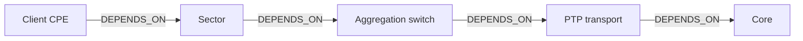
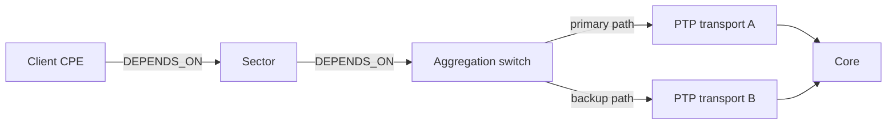
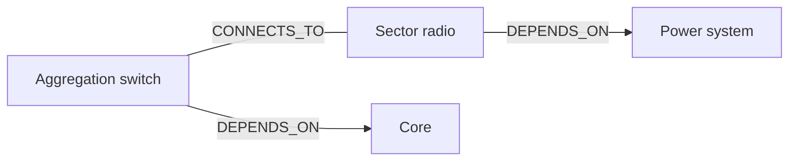

# CI Failure Correlation Topology Guide

This guide defines how to model CI relationships so that failure correlation identifies a plausible root cause without suppressing independent incidents.

> **Current implementation note:** the correlation query traverses `DEPENDS_ON`, `HOSTED_ON`, and `CONNECTS_TO` from a dependent CI toward an upstream CI, with a maximum depth of three hops. This document defines the target modeling policy; it does not change runtime behavior.

## Quick path

1. Model an operational dependency from the dependent CI to the CI it needs to function.
2. Use `DEPENDS_ON` for relationships that may propagate a root cause.
3. Keep physical or informational connectivity separate from causal dependency.
4. Verify a six-level representative chain before changing the correlation depth.
5. Treat redundant paths as a design decision, not an automatic propagation path.

## Core rule

A failure on CI `A` may explain a failure on CI `B` only when `B` cannot provide its monitored service without `A`.

The arrow always points from the **dependent** CI to its **dependency**:

```text
B -[:DEPENDS_ON]-> A
```

When `A` has an active root event and `B` fails for a propagating metric, `B` is an affected CI. It is not a separate root cause.

## Relationship policy

| Relationship | Meaning | Eligible for root-cause traversal? | Modeling rule |
| --- | --- | --- | --- |
| `DEPENDS_ON` | A CI needs another CI or service to operate. | Yes | Use for explicit operational and causal dependencies. Direction is dependent → dependency. |
| `HOSTED_ON` | A workload, virtual device, or service is hosted by a platform. | Usually yes | Use only when failure of the host makes the hosted CI unavailable. Direction is hosted CI → host CI. |
| `CONNECTS_TO` | Two CIs have a physical, logical, or transport connection. | Not by default | Do not assume it is causal. Use it for topology/visualization unless its direction and failure semantics are explicitly defined. |

`CONNECTS_TO` is the most important ambiguity to resolve. A radio link, client CPE, switch port, or PTP endpoint can be connected while having different failure domains. Connectivity alone does not prove that one CI is the root cause of the other.

## Six-level sector-network example

The example below models a customer device reaching the destination network through a sector, concentrator, and PTP transport. Each `DEPENDS_ON` arrow points toward the upstream dependency.

```mermaid
flowchart LR
  CPE[Level 1: Customer CPE]
  Access[Level 2: Access radio link]
  Sector[Level 3: Sector antenna]
  Switch[Level 4: Concentrator switch]
  PtpNear[Level 5: PTP near endpoint]
  PtpFar[Level 6: PTP far endpoint]
  Core[Destination network / core]

  CPE -->|DEPENDS_ON| Access
  Access -->|DEPENDS_ON| Sector
  Sector -->|DEPENDS_ON| Switch
  Switch -->|DEPENDS_ON| PtpNear
  PtpNear -->|DEPENDS_ON| PtpFar
  PtpFar -->|DEPENDS_ON| Core

  Sector -. physical RF path .-> Access
  PtpNear -. physical transport .-> PtpFar
```



### Expected result when the PTP fails

If `PtpFar` has an active root event, an affected CPE may be six hops away. A correlation depth of three cannot reach that event from the CPE in this model.

With a policy-approved depth of six or more, failures from the access chain can be associated with the PTP root event **only if every causal edge is modeled as `DEPENDS_ON` in the shown direction**.

The number of customer devices does not change the depth. Ten links with ten devices each increase the affected-CI fan-out, not the number of hops.

## Variable ecosystem: one topology, different outcomes

The same physical layout must not always produce the same correlation decision.

### A. Single-path access network



A PTP failure can be the root cause for the client because there is one operational path.

### B. Redundant upstream transport



Do **not** automatically mark all clients as affected when `PTP1` fails. First establish whether traffic actually failed over to `PTP2` and whether the monitored service is unavailable. This requires an explicit redundancy/failover policy.

### C. Physical connection without causal dependency



The physical `CONNECTS_TO` relationship is useful for visualization. It must not automatically imply that a radio event is caused by the switch, or vice versa.

## Event behavior

| Situation | Expected event behavior |
| --- | --- |
| No eligible active upstream event | Create or refresh a `ROOT` event for the failing CI. |
| Eligible active upstream root event | Record the CI as affected by that root cause and avoid a duplicate child incident when policy allows propagation. |
| Upstream root recovers | It must no longer be selected as an active root for future correlation. Recovery behavior for already affected CIs must be tested per event family. |
| Topology lookup fails | Preserve monitoring availability: fall back to independent `ROOT` events and alert operators about the correlation failure. |
| Metric is non-propagating | Keep the metric independent even if topology has an upstream event. |

Severity and correlation are separate concerns. A `WARNING` or `CRITICAL` event may be a root cause or a propagated symptom; severity does not establish causality by itself.

## Depth and performance policy

A greater depth expands the search scope; it does not fix an incorrect topology model.

| Option | Benefit | Risk |
| --- | --- | --- |
| Depth 3 | Bounded and inexpensive. | Misses legitimate long dependency chains. |
| Configurable depth 6–8 | Covers representative access/transport chains. | More graph traversal and potential false correlation if relationships are ambiguous. |
| Unbounded traversal | Covers arbitrary distance. | Unsafe: path expansion can grow rapidly in mesh-like topologies and may select distant, unrelated events. |

Before increasing the depth, capture execution plans and timings for a normal cycle and a fan-out incident. A simple dependency tree has low branching and is usually manageable; a graph containing many `CONNECTS_TO` edges can multiply candidate paths sharply.

## Modeling checklist

- [ ] Every propagation-eligible edge has direction: dependent → dependency.
- [ ] Every `DEPENDS_ON` edge represents a real operational failure dependency.
- [ ] `HOSTED_ON` is used only where host failure makes the child unavailable.
- [ ] `CONNECTS_TO` is not considered causal unless its semantics are explicitly approved.
- [ ] Redundant paths and failover behavior are documented.
- [ ] The intended maximum dependency depth is measured in production-like topology.
- [ ] A six-level chain and a fan-out scenario are covered by automated tests.
- [ ] A correlation lookup failure degrades safely to independent root events.

## Decision record required before implementation

Any implementation change must record these decisions:

1. Which relationship types are eligible for backend root-cause traversal.
2. Whether `CONNECTS_TO` is excluded, redefined, or split into causal and non-causal relation types.
3. The default and maximum traversal depth.
4. How redundancy and active/standby paths are modeled.
5. The performance budget and evidence from Neo4j query profiling.
6. Rollout, observability, and rollback criteria.

## Next step

Open a feature request for the correlation-policy analysis and implementation plan. It must remain in review until the topology semantics, test scenarios, and performance evidence are approved.
