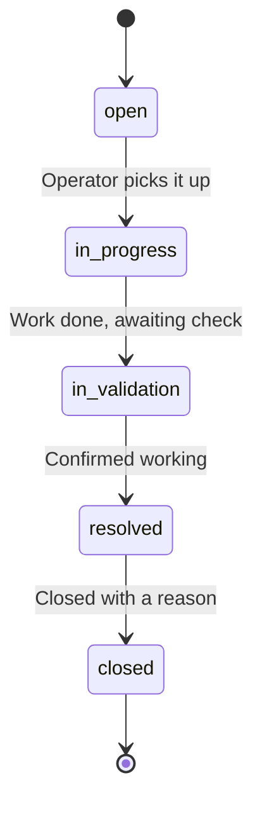
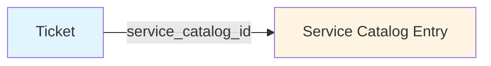

# User Manual — Service Catalog and Tickets

This manual explains how to use the ITSM module: the **Service Catalog** and **Tickets** (also called folios). It is written for everyday users — operators and admins who work with tickets day to day.

If you are looking for the operator runbook (startup checks, identity conflicts, migration steps), see `service-catalog-ticket-folios.md` instead.

## What is this module, in plain English?

Two related things, working together:

1. **Service Catalog** — the list of services your team operates. Each service has a name, an owner, an SLA, a tier.
2. **Tickets** — the work that happens on those services. A request ("I need access") or an incident ("X is down").

The catalog defines the *what*; tickets are the *work being done* on that what.

---

## The Service Catalog

### What goes into a service?

Each service is a card with the following fields:

| Field | What it means | Example |
|---|---|---|
| **Name** | What you call the service | "Network Monitoring" |
| **Owner team** | Who is responsible for it | "NOC" |
| **Category** | What kind of service | "Networks", "Apps", "Security" |
| **Tier** | Service level | Bronze, Silver, Gold |
| **Criticality** | How bad it is if it breaks | Low, Medium, High |
| **SLA target (minutes)** | How fast you promise to respond | 60 |
| **Active** | Whether the service is currently offered | Yes / No |

### How to use it

Open the console and go to **ITSM → Service Catalog** (URL: `/itsm/service-catalog`).

From there you can:

- Browse all services.
- Create a new one with the **Create** button.
- Edit an existing one.
- **Deactivate** a service when it is no longer offered.

### A note about deactivation

There is no "Delete" button, and that is on purpose. When you deactivate a service:

- It stops appearing in the active list.
- Old tickets that reference it still work — they keep their history intact.
- The service card stays in the system, just marked as inactive.

This protects your historical data. If a service comes back, you can reactivate it.

### Is this the same as the Inventory Catalog?

**No.** The Inventory Catalog lists equipment (routers, servers, devices). The Service Catalog lists the services your team operates. Two different things, two different pages.

---

## Tickets (Folios)

A ticket — or *folio*, we use the words interchangeably — is a record of work. There are two kinds:

| Type | When to use it | Example |
|---|---|---|
| **Request** | Someone is asking for something | "Please give me VPN access" |
| **Incident** | Something broke | "The monitoring platform is down" |

### What goes into a ticket?

| Field | Required? | What it means |
|---|---|---|
| **Ticket ID** | Yes | A unique identifier you choose or let the system generate |
| **Title** | Yes | One-line summary |
| **Description** | No | Details |
| **Service** | No | Which catalog service this is about |
| **Status** | Yes (automatic) | Always starts as `open` |
| **Archive flag** | Automatic | Marks the ticket as archived when closed |
| **Closed reason** | When closing | Why and how it was resolved |
| **Updated by** | Automatic | Who last touched it |

### How to use it

Open the console and go to **ITSM → Tickets** (URL: `/itsm/tickets`).

From there you can:

- See all tickets in a list.
- Filter by status, service, or archive status.
- Open a ticket to see its details and full history.
- Create a new one with **Create**.
- Edit, advance, or close existing ones.

---

## The five states of a ticket — how a ticket moves

A ticket always starts as **Open**. It moves forward through 5 states, one step at a time, in order. No skipping, no going back, no reopening.

### The flow

### What each state means

| State | Plain English |
|---|---|
| **Open** | Brand new. Nobody has touched it yet. |
| **In Progress** | Someone is actively working on it. |
| **In Validation** | The work is done, but somebody needs to verify it is correct. |
| **Resolved** | Verified — it is working. |
| **Closed** | Done and archived. No more changes allowed. |

### The rules

- **No skipping.** From "Open" you cannot jump straight to "Resolved". One step at a time.
- **No going back.** Once you are in "In Validation", you cannot return to "In Progress".
- **Closed is final.** A closed ticket is read-only forever. No edits, no status changes, no reopening.
- **Closing requires a reason.** You must write a short note explaining how it was resolved.

### What you see in the UI

The interface only shows you **the one button you can press right now**. If the ticket is in "Open", you only see "Move to In Progress". Closed tickets show a static "Closed" badge with no buttons at all.

---

## How tickets and services are connected

A ticket **points to** a service in the catalog. That is the whole relationship.

For example:

- You open a ticket: "Monitoring platform is throwing errors".
- You point it at the service "Network Monitoring".
- Now when you filter tickets by that service, this one shows up.

### The connection rules

- **A ticket can exist without a service.** Sometimes you are reporting something that does not fit any catalog entry yet.
- **If you assign a service, it has to exist.** The system will not let you point at a made-up service.
- **The ticket does not copy the service's data.** If you change the service's SLA tomorrow, old tickets do not update. Each ticket is a snapshot of the moment it was created.

---

## Permissions

Two levels of access:

| Permission | What you can do |
|---|---|
| **ITSM_VIEW** | See the catalog and tickets, list and view them |
| **ITSM_EDIT** | Create, edit, change status, deactivate |

Typical roles:

- **Operator** — has both permissions by default.
- **Admin** — has everything, including these.
- Other roles — depend on how they were configured.

If you get a "403 Forbidden" error, your role is missing the permission. Talk to your administrator.

---

## Important rules — what you cannot do

To avoid surprises:

1. **Nothing gets physically deleted.** Services get deactivated, tickets get closed and archived. Your history is preserved.
2. **No external system integration.** Tickets do not sync to Jira, ServiceNow, or any other system. This module stands on its own.
3. **Events do not create tickets automatically.** Operational alerts (alarms, metric breaches) and tickets are separate. An event will not open a ticket for you.
4. **Closed tickets do not reopen.** If the problem comes back, open a new one.
5. **You cannot skip states.** The system enforces the order.

---

## If the platform will not start

When the platform boots, it checks the catalog for integrity issues. If it finds identity problems (two services with the same ID, for example), the platform refuses to start until they are fixed. This protects your data.

If you see something like:

> Duplicate ServiceCatalog service_id detected

in the logs, manual database review is required. Do not try to delete or rewrite data blindly.

If the failure is an external dependency (the database temporarily unavailable, for example), the platform logs the error but keeps starting. Identity problems are the only thing that blocks startup.

---

## Glossary

| Term | What it means here |
|---|---|
| **Service Catalog** | The list of services your team operates |
| **Ticket / Folio** | A record of a request or an incident |
| **State** | The current step in a ticket's lifecycle |
| **Transition** | Moving a ticket to its next state |
| **Type** | `request` or `incident` |
| **Service reference** | The catalog service a ticket points at |
| **SLA target** | Maximum response time, in minutes |
| **Closed reason** | Required note when closing a ticket |
| **Archive** | Marking a closed ticket as inactive (does not delete it) |
| **Deactivate** | Taking a service out of active use (does not delete it) |
| **ITSM_VIEW** | Permission to read |
| **ITSM_EDIT** | Permission to modify |

---

## See also

- **Operator runbook** (startup, identity checks, recovery): `service-catalog-ticket-folios.md`
- **Architecture and design decisions**: `openspec/changes/itsm-service-catalog/design.md`
- **Technical specifications**: `openspec/specs/itsm-service-catalog/spec.md`
