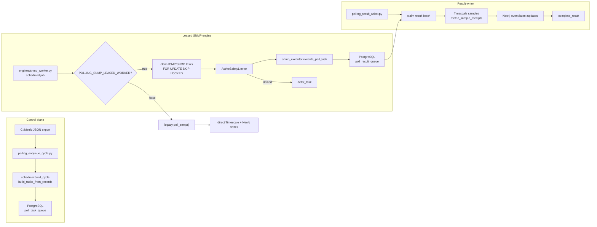

# Motor SNMP escalable

El nuevo motor SNMP separa la recoleccion, la cola de trabajo y la persistencia de resultados. Esto permite escalar el polling por leases, controlar la presion sobre dispositivos y bases de datos, y volver al worker legacy si el rollout necesita rollback.

## Resumen rapido

| Parte | Responsabilidad |
| --- | --- |
| `backend/engines/snmp_worker.py` | Entrada runtime. Decide entre worker legacy y worker leased segun flags. |
| `backend/scripts/polling_enqueue_cycle.py` | Crea un ciclo de polling y encola tareas desde un export JSON aprobado. |
| `backend/polling/pg_queue.py` | Maneja ciclos, tareas, resultados, leases, retries y dead-letter en PostgreSQL. |
| `backend/polling/snmp_worker.py` | Reclama tareas SNMP/ICMP bajo lease y produce envelopes de resultado. |
| `backend/polling/snmp_executor.py` | Ejecuta una tarea puntual y normaliza el resultado. |
| `backend/scripts/polling_result_writer.py` | Ejecuta el writer que persiste resultados pendientes. |
| `backend/polling/writer_pool.py` | Persiste muestras en Timescale/PostgreSQL, registra receipts idempotentes y actualiza eventos en Neo4j. |

## Diagrama de flujo



## Happy path operativo

1. El operador aplica las migraciones de cola de forma explicita:

   ```bash
   python backend/scripts/run_polling_migrations.py --dry-run
   python backend/scripts/run_polling_migrations.py
   ```

2. Se habilita `POLLING_PG_QUEUE_ENABLED=true` y se encola un ciclo controlado:

   ```bash
   python backend/scripts/polling_enqueue_cycle.py \
     --records-file /path/to/polling-records.json \
     --scheduled-for 2026-05-25T12:00:00Z \
     --config-version rollout-v1
   ```

3. El proceso `snmp-engine` entra por `backend/engines/snmp_worker.py`. Si `POLLING_SNMP_LEASED_WORKER=true`, reclama tareas SNMP/ICMP desde PostgreSQL en vez de ejecutar el polling serial legacy.

4. Cada tarea reclamada se ejecuta bajo limites de seguridad in-process y produce un `PollResultEnvelope` estable con `idempotency_key`.

5. El resultado se encola en `poll_result_queue`. El worker de polling ya no escribe directo en Timescale/Neo4j en el path escalable.

6. El writer se ejecuta bajo supervisor:

   ```bash
   python backend/scripts/polling_result_writer.py --worker-id writer-1
   ```

7. El writer persiste muestras, registra `metric_sample_receipts` para idempotencia y actualiza eventos/latest values en Neo4j.

## Flags principales

| Flag | Uso |
| --- | --- |
| `POLLING_PIPELINE_OBSERVE_ONLY` | Medir comportamiento actual antes de activar cambios. |
| `POLLING_PG_QUEUE_ENABLED` | Permitir encolar ciclos/tareas en PostgreSQL. |
| `POLLING_SNMP_LEASED_WORKER` | Cambiar el runtime SNMP/ICMP al path leased. |
| `POLLING_DB_WRITER_ENABLED` | Permitir que el writer persista resultados. |
| `POLLING_BACKPRESSURE_ENABLED` | Activar controles de admision en enqueue, por ejemplo rechazar ciclos que exceden `POLLING_BACKPRESSURE_MAX_TASK_QUEUE_DEPTH`; no es un loop adaptativo global. |
| `POLLING_METADATA_CACHE_ENABLED` | Validar version/TTL de metadata antes de admitir trabajo. |
| `POLLING_WORKERS` | Knob de sizing para benchmarks/despliegue; la concurrencia runtime depende de cuantos procesos supervise el operador y del batch size. |
| `POLLING_TASK_BATCH_SIZE` | Cantidad de tareas reclamadas por iteracion. |
| `POLLING_RESULT_BATCH_SIZE` | Cantidad de resultados persistidos por batch. |
| `POLLING_DB_WRITERS` | Cantidad esperada de writers de resultados. |

## Rollback mental model

El rollback principal es volver al path legacy:

1. detener writers;
2. desactivar `POLLING_DB_WRITER_ENABLED`;
3. desactivar `POLLING_SNMP_LEASED_WORKER`;
4. dejar la cola intacta para replay/auditoria;
5. continuar con `poll_snmp()` legacy mientras se revisa la causa.

No borres tablas de cola durante un incidente. Las filas en `available`, `retry_wait`, `deferred` o leases expirados son material de replay y diagnostico.

## Caveats actuales

- Backpressure y metadata cache hoy son controles de admision de cola, no un loop adaptativo profundo dentro de todos los workers.
- `ActiveSafetyLimiter` es in-process; no coordina limites globales entre multiples instancias.
- El path legacy y el path leased son mutuamente excluyentes por flag, pero una mala configuracion de procesos podria duplicar actividad contra dispositivos.
- El writer debe correr separado del worker leased para que los resultados lleguen a Timescale/Neo4j.
- `MQTT_STUB` existe como contrato/stub de simulacion, no como soporte MQTT productivo completo.

## Donde seguir

- Rollout paso a paso: [`docs/polling-pipeline-runbook.md`](polling-pipeline-runbook.md)
- Tuning y benchmarks: [`docs/polling-pipeline-tuning.md`](polling-pipeline-tuning.md)
