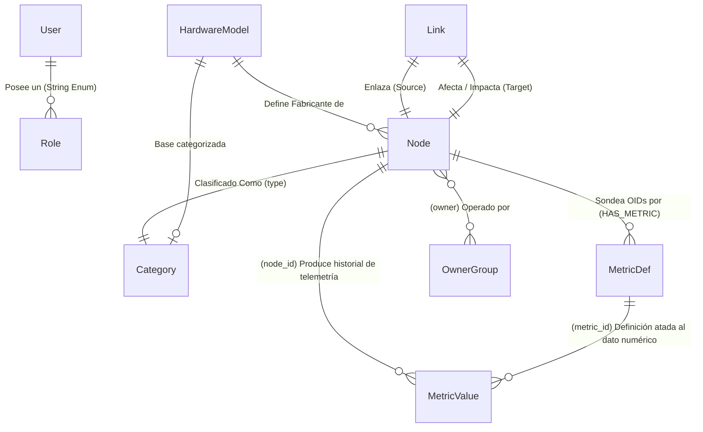

# 📊 Modelo Entidad-Relación (NEX-GEN ITOM)

Este documento detalla el Modelo Entidad-Relación (ER) completo de la plataforma NEX-GEN, agrupado por la base de datos de persistencia en donde reside cada entidad. Todos los campos extraídos del código backend (`backend/models`) están descritos con sus respectivos tipos de datos.

---

## 🟢 1. Base de Datos de Grafos (Neo4j)

Las entidades de Graph DB están modeladas usando Pydantic y representan topología y configuraciones estructurales (CIs, relacionales, métricas lógicas).

### Entidad: `Node` (Configuration Item / CI)
Representa un activo, componente de red o dispositivo.

| Campo | Tipo / Formato | Obligatorio | Valor por Defecto / Detalles |
| :--- | :--- | :---: | :--- |
| `id` | `str` | Sí | Identificador único del Nodo. |
| `label` | `str` | Sí | Nombre / Etiqueta visible del Nodo. |
| `type` | `str` | Sí | Tipo o Categoría base del CI. |
| `status` | `str` | No | `"OK"` (Estado general de salud). |
| `ip` | `str` | No | Dirección IP del host. |
| `location` | `dict` | No | Objeto con coordenadas/detalles espaciales. |
| `metadata` | `dict` | No | Campos arbitrarios adicionales (tags). |
| `owner` | `str` | No | Propietario o Response Group responsable. |
| `locationName` | `str` | No | Nombre legible de la localización física. |
| `pollingInterval` | `int` | No | `60` (Frecuencia de sondeo en segundos). |
| `snmp` | `Union[dict, str]` | No | Configuración/Comunidad SNMP asíncrona. |
| `brand` | `str` | No | Marca o fabricante del CI. |
| `model` | `str` | No | Modelo del dispositivo físico. |
| `serialNumber` | `str` | No | Número de serie. |
| `firmwareVersion` | `str` | No | Versión de firmware/OS. |
| `metrics` | `List[Dict[str, Any]]`| No | Lista pre-calculada de las métricas que afectan al CI. |

### Entidad: `Link` (Relaciones Topológicas / Edges)
Rutas conectivas o dependencias de nivel de arquitectura.

| Campo | Tipo / Formato | Obligatorio | Valor por Defecto / Detalles |
| :--- | :--- | :---: | :--- |
| `source` | `str` | Sí | `id` del Nodo origen. |
| `target` | `str` | Sí | `id` del Nodo de destino. |
| `relationship` | `str` | Sí | Tipo de conexión (Ej. `DEPENDS_ON`, `CONNECTS_TO`). |
| `id` | `str` | No | Identificador del Link (opcional). |
| `source_label` | `str` | No | Etiqueta del Nodo Origen (desnormalizado). |
| `target_label` | `str` | No | Etiqueta del Nodo Destino. |

### Entidad: `MetricDef` (Definición Lógica de Métrica)
Define el patrón y alertas base de telemetría a asociar contra los CIs.

| Campo | Tipo / Formato | Obligatorio | Valor por Defecto / Detalles |
| :--- | :--- | :---: | :--- |
| `id` | `str` | Sí | Identificador de definición de Métrica. |
| `protocol` | `str` | Sí | `"SNMP"` (U otros agentes de sondeo). |
| `oid` | `str` | No | Identificador SNMP para consulta técnica. |
| `warning` | `float` | No | Umbral de advertencia para alarmas. |
| `critical` | `float` | No | Umbral crítico para fallos inminentes. |
| `dataType` | `str` | No | `"INTEGER"` |
| `unit` | `str` | No | Unidad de medición (%, Kbps, C°). |
| `description` | `str` | No | Detalles funcionales de la métrica. |
| `criticality` | `int` | No | Nivel base (1: Info, 2: Warning, 3: Exception). |
| `applicable_to` | `Dict[str, List[str]]` | No | Diccionario para auto-reconciliación por marca/modelo o CIs explícitos. |

### Entidad: `Category`
Entidad para clasificación semántica base de inventarios.

| Campo | Tipo / Formato | Obligatorio | Valor por Defecto / Detalles |
| :--- | :--- | :---: | :--- |
| `name` | `str` | Sí | Nombre unívoco de una categoría de equipos. |

### Entidad: `HardwareModel`
Diccionario canónico de fabricantes y variantes de dispositivos de la infraestructura.

| Campo | Tipo / Formato | Obligatorio | Valor por Defecto / Detalles |
| :--- | :--- | :---: | :--- |
| `brand` | `str` | Sí | Nombre del fabricante (Ej. Cisco, HP). |
| `model` | `str` | Sí | SKU específico. |
| `category` | `str` | No | Referencia lógica a `Category`. |
| `owner` | `str` | No | Enlace a la unidad/group de propiedad. |

### Entidad: `OwnerGroup`
Agrupación de técnicos L1/L2 para escalado de incidentes o inventario de CIs.

| Campo | Tipo / Formato | Obligatorio | Valor por Defecto / Detalles |
| :--- | :--- | :---: | :--- |
| `name` | `str` | Sí | Nombre descriptivo del Grupo Soporte. |
| `users` | `List[dict]` | No | Array de diccionarios referenciando a usuarios internos. |

---

## 📈 2. Base de Datos de Series Temporales (TimescaleDB / PostgreSQL)

Almacenamiento optimizado de telemetría e ingesta por workers. 

### Entidad/Tabla: `metric_values`
Registra el historial síncrono muestreado por los colectores de métricas.

| Columna SQL | Tipo SQL | PK | Índice | Obligatorio | Detalles |
| :--- | :--- | :---: | :---: | :---: | :--- |
| `time` | `DateTime(timezone=True)`| **Sí** | - | Sí | Timestamp del Muestreo (Hiper-tabla Timescale). |
| `node_id` | `String` | **Sí** | Sí (Cy) | Sí | Referencia al `id` del Node (CI Neo4j). |
| `metric_id` | `String` | **Sí** | - | Sí | Referencia a la entidad de la `MetricDef`. |
| `value` | `Float` | - | - | Sí | Valor numérico devuelto por el protocolo en T. |

> **Nota de Índices**: Cuenta con un composite index `idx_metric_values_node_time` integrando `(node_id, time)` para máxima eficiencia de renderizado o cálculos AIOps sobre secuencias.

---

## 🔒 3. Base de Datos Relacional / IAM (PostgreSQL)

El módulo IAM interactúa con PostgreSQL (mediante SQLAlchemy / Pydantic) para el Control de Acceso Basado en Roles (RBAC).

### Entidad/Tabla: `users`
Manejo local de cuentas y su control fino de visibilidad sectorial.

| Columna SQL | Tipo SQL | PK / Único | Obligatorio | Detalles |
| :--- | :--- | :---: | :---: | :--- |
| `id` | `Integer` | **PK** | Sí | ID numérico indexado por SQLAlchemy. |
| `username` | `String` | Único / IDx | Sí | Alias del operador o administrador. |
| `hashed_password` | `String` | - | Sí | Hash asimétrico seguro de credenciales. |
| `email` | `String` | IDx | No | Correo electrónico de notificaciones. |
| `phone` | `String` | - | No | Teléfono de guardia/directorio. |
| `role` | `String` | - | No | Valor default: `"VIEWER"`. |
| `is_active` | `Boolean` | - | No | Bloqueo o deshabilitación. Default: `True` |
| `force_password_change` | `Boolean` | - | No | Petición para cambio al primer Login. Default: `False` |
| `permissions` | `ARRAY(String)` | - | No | Vector explícito de privilegios (`['EVENT_VIEW', 'CI_EDIT']...`) |
| `allowed_locations` | `ARRAY(String)` | - | No | Filtro geofísico de multi-tenancy. Funciona para esconder graneros. |
| `allowed_ci_types` | `ARRAY(String)` | - | No | Restricciones operativas (Ej: Ver sólo Router, no Switches). |

### Pydantic - RBAC/ACL Core Structure (App Memory)
Modelos secundarios que alimentan las validaciones Auth y Roles integrados en FastApi (`user.py`):

- **UserPermission (Enumeración Fija)**: 
  - Subcategorías del sistema para: Eventos (`EVENT_VIEW`, `EVENT_ACK`, `EVENT_CLOSE`), CMDB/CIs (`CI_VIEW`, `CI_EDIT`, `CI_DELETE`), Diagnósticos avanzados (`RUN_DIAGNOSTICS`), Sistema (`USER_MANAGE`, `ROLE_MANAGE`) y Telemetría visual (`METRICS_VIEW`).
- **Role (Clase lógica Pydantic)**:
  - Estructuración de roles personalizados en IAM (`name`, `description`, Array de sub-permisos (`UserPermission`), bool de `is_system` asegurando el grupo Inmutable).

---

## 🗺️ Mapa Interaccional del Ecosistema (Diagrama Relacional Virtual)

