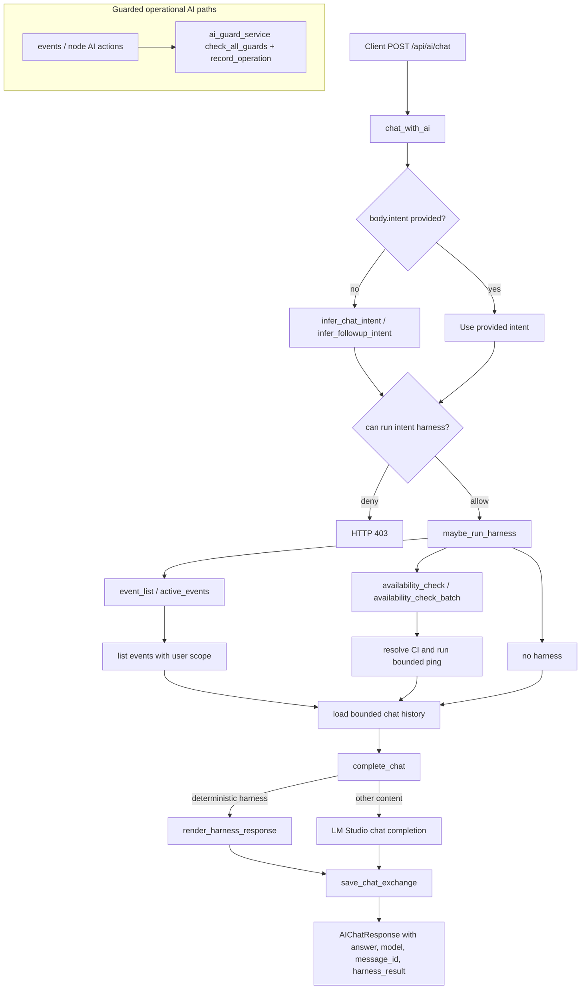

# Exploration: issue-375-ai-chat-guardrails

## 1) Current orchestration model

The flow is **backend-owned deterministic harness orchestration**. It is not provider-native or model-native tool calling.

- `/api/ai/chat` handles intent selection and execution in backend code.
- Supported backend harnesses are executed through `maybe_run_harness` in `backend/services/ai_chat_service.py`.
- Deterministic harness types such as `event_list`, `availability_check`, and `availability_check_batch` can be rendered locally without calling LM Studio.
- LM Studio is used for non-deterministic chat content after bounded context and harness output are assembled.

## 2) Current flow

## 3) Raven usage / boundary

Raven is currently a documented boundary/future integration point, not a runtime integration in the chat orchestration flow.

- Current docs indicate backend-owned tool catalog and backend-owned execution.
- Policy boundaries forbid the model from directly writing Raven or other operational stores.
- If Raven becomes part of diagnostics/attention, it needs an explicit backend bridge/adapter contract rather than prompt-only policy.

## 4) Tool execution and authorization flow

1. Intent detection:
   - Uses structured request intent when present.
   - Otherwise uses backend inference (`infer_chat_intent`, follow-up inference from history/context).
2. Authorization:
   - Chat router checks permissions per intent family.
   - Availability diagnostics require diagnostic permission or AI diagnostic permission with the expected view scope.
   - Event-list harness requires event-view or AI view permissions.
3. Execution:
   - `maybe_run_harness` dispatches through fixed backend executors.
   - Event listing applies user scope constraints.
   - Availability resolves CI and executes bounded ping semantics.
4. Response:
   - Harness results are included in the model payload or rendered deterministically.
   - Chat exchange persists answer and `harness_result`.
5. Existing operational AI guards:
   - Event/node operational AI paths use `ai_guard_service` for cooldowns, behavioral guards, bulk detection, operation recording, and denial logic.
   - The chat harness path appears separate from this guardrail plane.

## 5) Initial context / history / prompt handling

- Chat history is loaded from persisted `AIChatMessage` rows with turn and character bounds.
- User-provided context is injected into the prompt with size limits.
- System prompt is assembled from identity/tool/policy markdown with fallback and capped reads.
- Prompt instructions explicitly block claims of executed diagnostics when no backend harness result is present.
- Follow-up availability can be inferred from previously persisted event-list harness metadata.

## 6) Recoverable pieces

- `HARNESS_EXECUTORS` and deterministic rendering are good seams for a shared execution contract.
- Existing permission checks should remain and become the first gate before guardrails.
- `ai_guard_service` already centralizes important safety behavior and should be reused rather than duplicated.
- Tool catalog markdown under `backend/ai/tools/*` is useful as human/model-facing documentation.
- Persisted `harness_result` gives a recovery point for auditability and follow-up context.

## 7) Critical gaps / risks / planning constraints

- The system does not currently have true model-native tool calling or an explicit function-call schema loop.
- The chat harness path appears to use permissions but not the same `ai_guard_service` guardrails as operational AI endpoints.
- Raven is not implemented as a runtime adapter, so any design must explicitly define whether Raven is read-only context, write target, or out of scope.
- Regex/heuristic intent inference can misroute ambiguous follow-ups.
- Availability diagnostics depend on host-level bounded `ping` behavior.
- Existing cooldowns may be in-memory while operation logs are persistent, so guard design must account for restart/replay behavior.

## 8) Evidence paths

- `backend/routers/ai.py`
- `backend/services/ai_chat_service.py`
- `backend/services/ai_guard_service.py`
- `backend/routers/events.py`
- `backend/models/ai_chat.py`
- `backend/ai/tools/README.md`
- `backend/ai/tools/event-list.md`
- `backend/ai/tools/availability_check.md`
- `backend/ai/policies/response-boundaries.md`
- `backend/tests/test_ai_chat_service.py`
- `backend/tests/test_routers_events.py`
